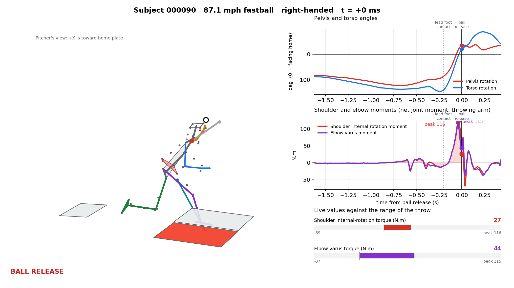

# Biomech — 3D inverse dynamics of baseball pitching

This project turns raw motion-capture recordings of baseball pitchers into the quantity a
pitching-biomechanics study cares about most: the **torques at the throwing shoulder and
elbow** — and shows them, together with the pelvis and torso motion, in a slow-motion
animation of the throw.

It starts from C3D files (45 markers at 360 Hz plus three force plates at 1,080 Hz) for 17
pitchers and 60 fastballs, and ends with per-pitch joint kinetics that were **checked against
an independent reference** (the OpenBiomechanics Project's own results for the same pitches).

<p align="center">
  
</p>
<p align="center"><em>One frame of the animation (<code>animation.py</code>) at ball release: the pitcher in 3D with the force
plates and the torque arrows at the shoulder, the pelvis and torso angles, and the shoulder and elbow torques
with a moving cursor. The full slow-motion GIF is <code>backend/analysis/results/000090_pitch2.gif</code>.</em></p>

## What it computes

For every throw:

| Output | What it is |
|---|---|
| Joint angles | Hip, knee, ankle and shoulder angles in ISB-style Cardan/Euler sequences, referenced to each pitcher's static calibration trial |
| Segment kinematics | Filtered positions, accelerations, and angular velocity/acceleration from rotation matrices |
| Ground reaction | Force, moment and center of pressure from the three force plates, assigned to whichever foot is on each plate |
| **Joint forces and moments** | Full-body 3D Newton–Euler inverse dynamics: ankle, knee, hip, lumbar, shoulder and elbow |
| **Shoulder internal-rotation torque** | Moment about the humerus long axis |
| **Elbow varus torque** | Moment about the ISB floating axis |
| Pelvis and torso rotation | About the vertical, 0° = facing home plate, closed = negative |

## How it works

```
C3D files ──► HDF5 archive ──► joint angles ─┐
 (markers,     (c3d_to_hdf5)   (analysis)     ├──► inverse dynamics ──► results + animation
  force plates)                               │    (dynamics,             (export_results,
                 force-plate geometry ────────┘     inverse_dynamics)      animation)
                                                          │
                          validated against ◄─────────────┘
                          OpenBiomechanics (validate_against_obp)
```

**Body model.** Each pitcher is 15 rigid segments (head, thorax, pelvis, two arms as upper arm
+ forearm + hand, two legs as thigh + shank + foot). Masses, centers of mass and full 3D
inertia tensors come from de Leva (1996), scaled by body mass and the measured segment
lengths. The trunk is split into a thorax and a pelvis, because a single rigid trunk cannot
represent a pitcher whose pelvis and thorax counter-rotate.

**Inverse dynamics.** The arms and head are solved from their free ends inward. The throwing
hand carries a 5 oz (0.142 kg) ball until release. The legs are solved from the ground
reaction upward. The two meet at the thorax, and the mismatch there is reported as the
model's own error estimate.

**Choices that matter, and why they are what they are** (all found by testing against the
reference data, not assumed):

* **Filter cutoff — 22 Hz for the arm, 12 Hz for everything else.** Differentiating noisy
  marker data twice makes the answer depend heavily on the filter. At 12 Hz the arm's peak
  torques come out 20–25 % too low; at 40 Hz they are noise-inflated.
* **Ball release** is the peak speed of the fingertip (wrist + 0.19 m along the hand). It
  matches the measured ball-release time to 0.1 ± 1.4 frames.
* **Hip and shoulder joint centers** use fixed offsets calibrated to the reference's own
  landmarks. The published regression coefficients first used put them 6–7 cm off, and the lead-hip
  moment was 35 % too low because of it.
* **The ball must be modelled.** Without it the internal-rotation and varus peaks fall to
  about 79 % and 74 % of the reference.
* **Force-plate axes** cannot be read from the C3D corner order; they were determined from the
  data and confirmed on every trial.

## Validation

Compared with the OpenBiomechanics Project's joint kinetics for the same 59 pitches
(`backend/analysis/results/validation_vs_obp.csv`; reproduce with `validate_against_obp.py`):

| Quantity | This project | OpenBiomechanics | Ratio (mean ± sd) |
|---|---|---|---|
| Peak shoulder internal-rotation torque | 124 N·m | 121 N·m | 1.03 ± 0.09 (r = 0.87 across pitches) |
| Peak elbow varus torque | 117 N·m | 126 N·m | 0.93 ± 0.07 (r = 0.91) |
| Ball release time | | | +0.1 ± 1.4 frames |

Over time, the moment curves for ankle, knee and hip correlate with the reference at
r = 0.93–0.99 (shoulder 0.82, elbow 0.92), with peak ratios of 0.89–1.01 at the leg joints.
Knee, ankle, elbow and wrist joint centers agree with the reference to 1–3 mm.

**Known discrepancies.** Peak shoulder and elbow *forces* run about 11 % and 16 % above the
reference, for a reason not yet identified. The trunk closure error (the mismatch where the
arm-and-leg solutions meet) is 22 % of the peak hip force at the median and 14–32 % for nine
pitches in ten. One pitch (000905, trial 001) is flagged in `summary.csv` because its plates could not
be matched to feet.

**Read the torques with care.**

* Validation shows this pipeline reproduces the reference's numbers. It does not show either is
  the true tissue load. Treat the values as net joint torques from this model, with roughly a
  ±10–20 % dependence on the filter and ball assumptions.
* The torques are high next to classic textbook values (about 65 N·m) but in line with modern
  high-rate motion capture (about 100–125 N·m). Net joint torque is shared with muscle, so it is
  not the load on the ulnar collateral ligament.
* **Shoulder internal-rotation and elbow varus torque are largely the same physical quantity.**
  At roughly 100° of elbow flexion the varus axis lies within about 19° of the humerus long
  axis, and the elbow's moment is passed up the upper arm almost unchanged. In this data the two
  peaks correlate at 0.94 (0.98 in the reference's 411 pitches). Treat them as one variable when
  analysing what drives the load, not as two independent findings.

## Getting started

```bash
pip install -r backend/requirements.txt
cd backend/analysis
```

The C3D recordings and the HDF5 archive are large and are **not in the repository**
(`*.c3d` and `*.h5` are git-ignored). Put the C3Ds under `backend/analysis/data/c3d/<subject>/`.
The subject metadata (body mass, height, pitch speed) is `biomechanics/metadata (2).csv`.

```bash
# 1. Build the HDF5 archive from the C3D files (also stores force-plate geometry)
python c3d_to_hdf5.py convert data/c3d data/master.h5

# 2. Joint angles for every trial
python analysis.py

# 3. Whole-body inverse dynamics for one subject, with a summary per pitch
python inverse_dynamics.py 000072

# 4. Results for every pitch -> results/summary.csv, arm_timeseries.csv, kinetics.h5
python export_results.py

# 5. Animation of one throw (a slow-motion GIF plus a snapshot at ball release)
python animation.py 000072 --snapshot --t-start -1.2 --t-end 0.4
python animation.py 000072 --player      # interactive KTK 3D player instead (needs a display)

# 6. Check against the OpenBiomechanics results (needs that repository on disk)
python validate_against_obp.py --out results/validation_vs_obp.csv

# Unit tests for the dynamics against motions with a known analytic answer
python test_dynamics.py
```

`export_results.py` documents every output column in its header. Moments are in N·m, forces in
N, and are **not** body-mass normalised (mass and height are in `summary.csv`). A joint's load is
what the proximal segment applies to the distal one.

## Repository layout

```
backend/analysis/
  c3d_to_hdf5.py          C3D -> HDF5 archive, incl. force-plate geometry
  analysis.py             segment frames, joint centers, ISB joint angles, de Leva table
  dynamics.py             filtering, rigid segments + inertia tensors, Newton–Euler, force plates
  inverse_dynamics.py     whole-body model: arms, legs, trunk, ball, foot–plate assignment
  export_results.py       per-pitch summary CSV, arm time-series CSV, HDF5 of all joint loads
  validate_against_obp.py comparison with the OpenBiomechanics results
  animation.py            slow-motion dashboard (matplotlib) and KTK player
  test_dynamics.py        analytic tests
  results/                summary.csv, validation_vs_obp.csv, example animations
backend/                  Django scaffold for a future web front end (not used by the analysis)
biomechanics/             subject metadata
```

## Limitations

* **One pitch type, one level.** All 60 trials are fastballs from independent-league (37) and
  minor-league (23) pitchers, at 70–93 mph.
* **No ball marker.** Ball position is inferred from the hand, so the load near release rests on
  two assumptions (0.19 m fingertip distance, fingertip-speed-peak release). Moving the ball
  ±4 cm changes the shoulder peak by about 6 %.
* **Inertia is estimated, not measured.** Segment masses and inertias are population averages
  scaled to each pitcher.
* **Marker-based joint centers.** The hip and shoulder centers are regression estimates, and
  soft-tissue movement of the markers is not corrected.
* **Small sample.** 17 pitchers is enough to validate the method, not to draw population
  conclusions.

## References and data

* de Leva P. (1996). Adjustments to Zatsiorsky–Seluyanov's segment inertia parameters.
  *J Biomech* 29(9):1223–1230.
* Wu G. et al. (2002, 2005). ISB recommendations on definitions of joint coordinate systems
  (lower limb; shoulder, elbow, wrist and hand). *J Biomech*.
* The C3D recordings and the reference joint kinetics are from the
  [OpenBiomechanics Project](https://github.com/drivelineresearch/openbiomechanics) (Driveline
  Baseball). See that repository for its license and how to cite it.
* [Kinetics Toolkit](https://kineticstoolkit.uqam.ca) is used for segment frames, joint angles
  and the interactive player.
